# Databricks observability demo

This demo illustrates the collection of metrics, traces and logs from Databricks using OpenTelemetry.

It showcases an automated deployment of a solution with Azure Databricks, sample jobs and collection to Azure Monitor.

## Features

This demo provides the following features:

* Configuring the [Azure Monitor OpenTelemetry Agent](https://learn.microsoft.com/azure/azure-monitor/app/opentelemetry-enable?tabs=net) for Databricks worker and executor Java processes
* Collecting detailed Spark metrics through JMX
* Collecting request traces to external services
* Collecting Spark logs
* Collecting custom spans and metrics, including streaming metrics

The demo is automated and can be deployed using Terraform with just two commands.

## Getting Started

### Prerequisites

* [Azure CLI](https://learn.microsoft.com/cli/azure/install-azure-cli)
* [Terraform](https://www.terraform.io/downloads.html)

Note: you can also use [Azure Cloud Shell](https://learn.microsoft.com/en-us/azure/cloud-shell/overview) to avoid having to install software locally.

### Installation

* `git clone https://github.com/Azure-Samples/databricks-observability.git`

* `cd databricks-observability`

* Download the latest [Application Insights Java agent JAR](https://github.com/microsoft/ApplicationInsights-Java/releases) to the project directory. Rename the file to `applicationinsights-agent.jar` in the repository folder.

  Alternatively, run this command:

  ```shell
  wget -O applicationinsights-agent.jar https://github.com/microsoft/ApplicationInsights-Java/releases/download/3.4.13/applicationinsights-agent-3.4.13.jar
  ```

* Log in with Azure CLI *(in Azure Cloud Shell, skip this step)*:

  ```shell
  az login
  ```

* Run:

  ```shell
  terraform init
  terraform apply
  ```

  When prompted, answer `yes` to deploy the solution.

⚠️ This sets up a cluster of two nodes, and recurring jobs running every minute, so that the cluster never automatically shuts down. **This will incur high costs if you forget to tear down the resources!**

In case transient deployment errors are reported, run the `terraform apply` command again.

## Destroying the solution

Run:

```shell
terraform destroy
```

## Spark Logs and Metrics

Spark Logs and Metrics are collected automatically by the JVM agent.

In the [Azure Portal](https://portal.azure.com/#view/HubsExtension/BrowseResource/resourceType/microsoft.insights%2Fcomponents), open the deployed Application Insights resource. Open the `Logs` pane.

Run the sample queries provided to visualize different metrics and logs.

Note that there might be a log of a few minutes until the data appears.

### Tasks

```kql
customMetrics
| where name endswith 'Tasks'
| render timechart
```

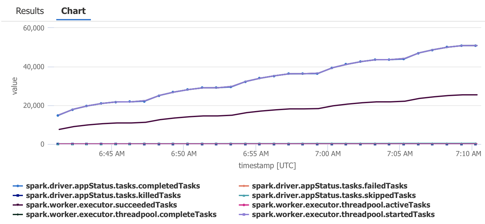

### Memory

```kql
customMetrics
| where name startswith 'spark'
| where name contains 'Memory'
| project-rename memory_bytes = value
| render timechart
```

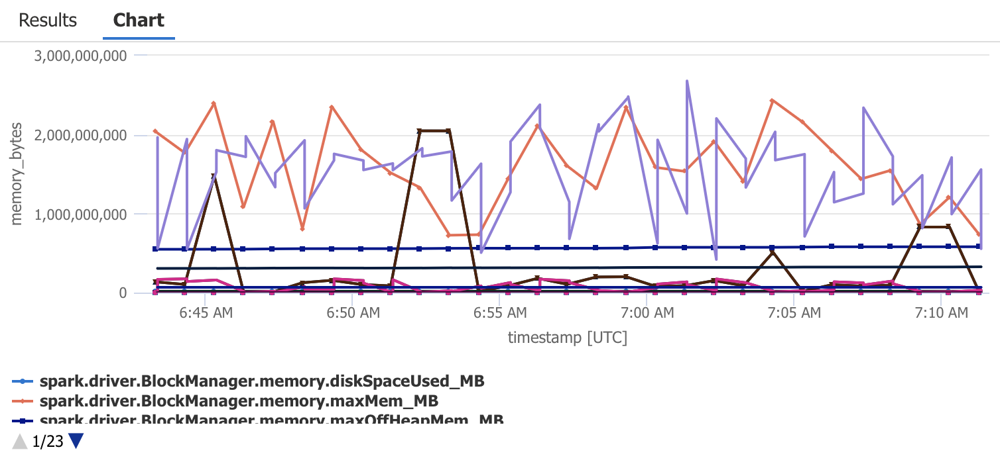

```kql
customMetrics
| extend ip = iif(tobool(customDimensions["DB_IS_DRIVER"]), "driver", customDimensions["DB_CONTAINER_IP"])
| where name in ('spark.driver.ExecutorMetrics.OnHeapUnifiedMemory', 'spark.worker.ExecutorMetrics.OnHeapUnifiedMemory')
| project timestamp, ip, heap_memory_bytes = value
| render timechart
```

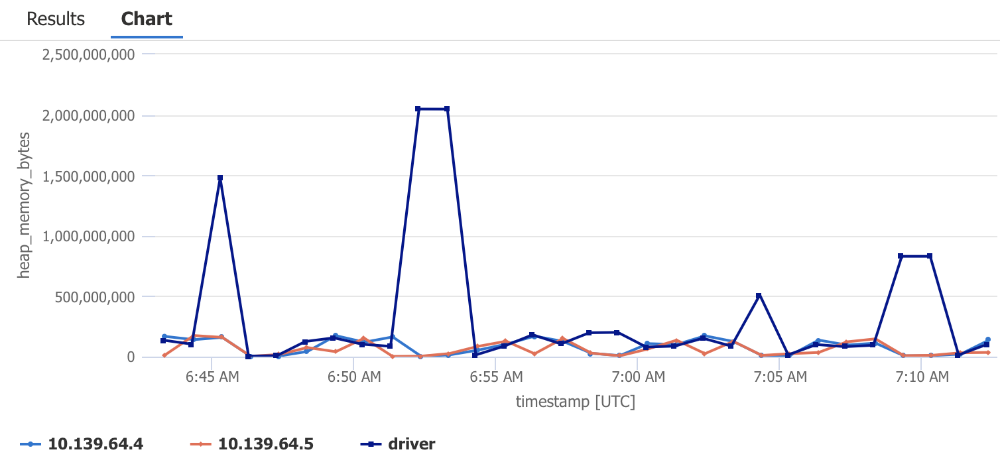

### Scheduler message processing time

```kql
customMetrics
| where name contains "messageProcessingTime"
| project-rename messageProcessingTime_ms = value
| where not(name contains "count")
| render timechart
```

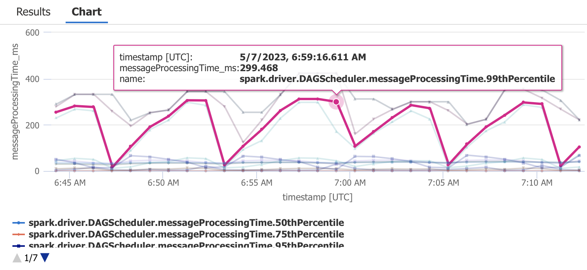

### Structured streaming

```kql
customMetrics
| where name startswith 'spark.streaming.'
| render timechart
```

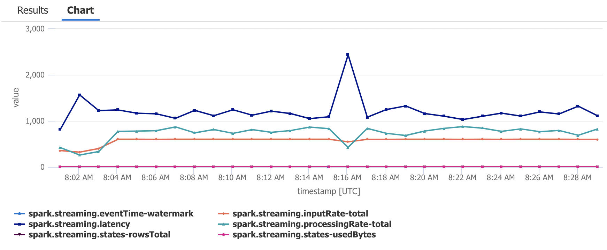

Note these are high-level metrics for all streaming queries. For capturing detailed metrics, see *Custom streaming metrics* below.

### Logs

```kql
traces
```

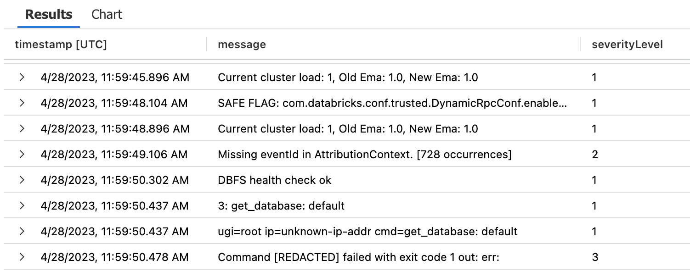

### Python and Java log correlation

By using Spark's [integration with Mapped Diagnostic Context (MDC)](https://spark.apache.org/docs/latest/configuration.html#configuring-logging), as demonstrated in [`sample-telemetry-notebook.py`](modules/databricks/notebooks/sample-telemetry-notebook.py), some Java logs can be correlated with their corresponding Python root span.

```kql
// Get trace ID via an arbitrary root span.
let trace_id = dependencies
| where name == "process trips"
| project operation_Id
| limit 1;
// Fetch the logs from both Python and Java through manual correlation.
traces
| where (operation_Id in (trace_id)) or (customDimensions["mdc.pyspark_trace_id"] in (trace_id))
```

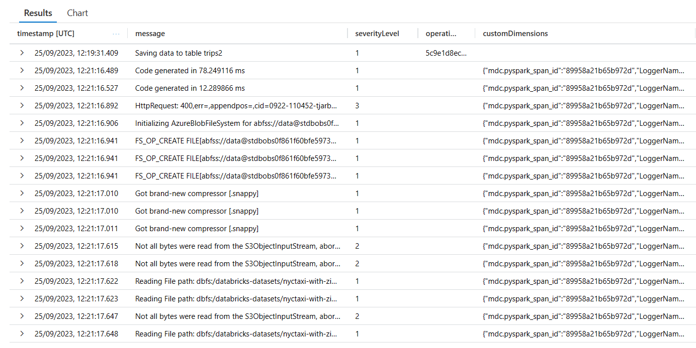

## JVM Traces

Traces are automatically collected, allowing to trace distributed requests to services like Azure Storage, SQL Server and other types of storage.

### Application Map

In Application Insights, open the `Application Map` pane.

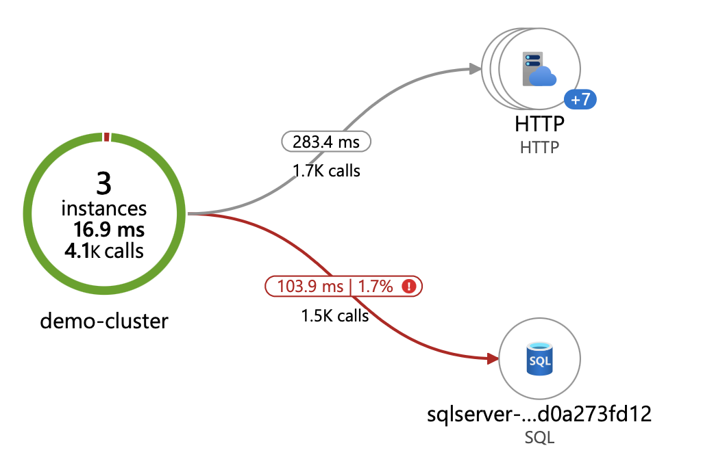

## Python Telemetry

Instrumenting Python code requires additional code. The [telemetry notebooks](modules/databricks/notebooks/) illustrate how that can be achieved.

### Custom logs and spans

The notebook [sample-telemetry-notebook](modules/databricks/notebooks/sample-telemetry-notebook.py) contains code to capture custom logs and spans.

The notebook is wrapped in a [sample-telemetry-caller](modules/databricks/notebooks/sample-telemetry-caller.py) notebook to ensure the end of the root span is recorded.

In Application Insights, open the `Transaction search` pane. In the `Event types` filter, select `Dependency`. In the `Place search terms here` box, type `process`.  In the `Results` pane, select any result with `Name: process trips`.

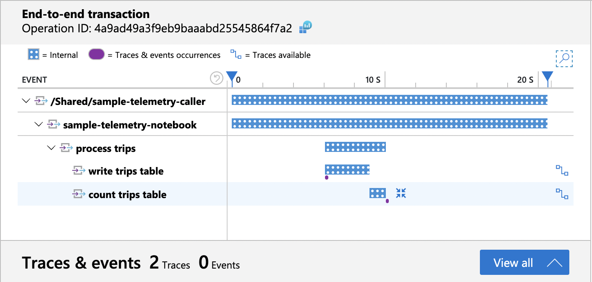

Open the `Traces & events` pane for the transaction at the bottom of the screen.

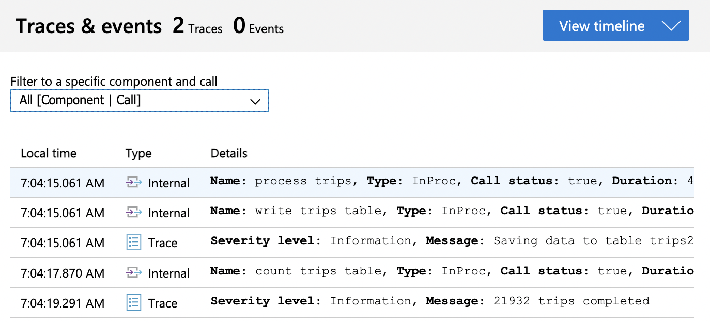

### Custom metrics

The notebook [sample-telemetry-notebook](modules/databricks/notebooks/sample-telemetry-notebook.py) also contains code to capture custom metrics.

In Application Insights, open the `Metrics` pane. In the `Metric Namespace` filter, select `/shared/sample-telemetry-notebook`.  In the `Metric` filter, select `save_duration`.

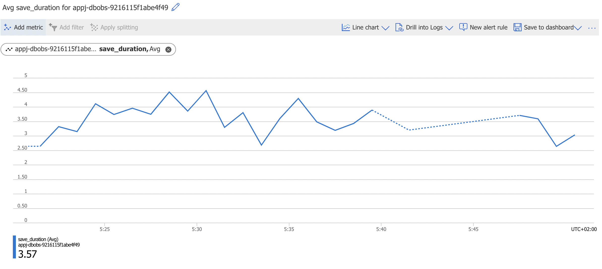

### Custom streaming metrics

The notebook [sample-streaming-notebook](modules/databricks/notebooks/sample-streaming-notebook.py) contains code to capture custom metrics from a streaming query.

In Application Insights, open the `Metrics` pane. In the `Metric Namespace` filter, select `/shared/sample-streaming-notebook`.  In the `Metric` filter, select `avg_value`.

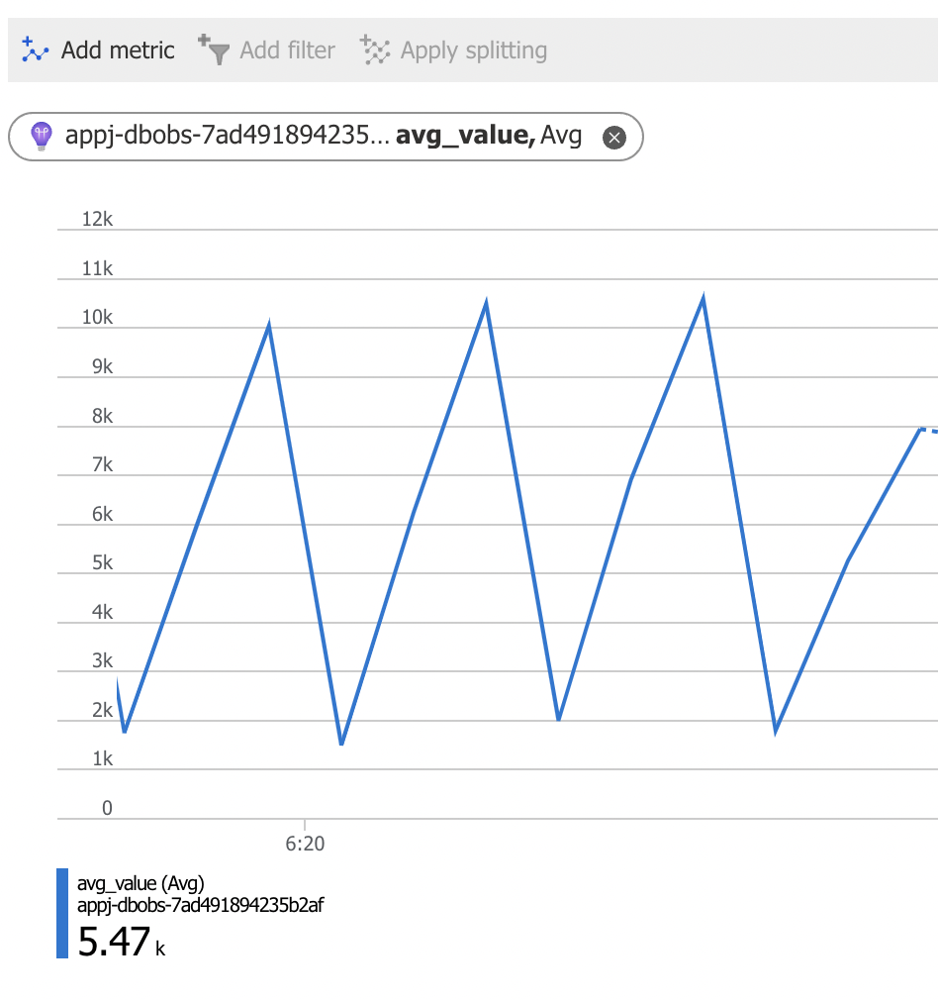

## About the solution

### Overview

The solution deploys Azure Databricks connected to Azure Application Insights for monitoring via the [Spark JMX Sink](https://spark.apache.org/docs/latest/monitoring.html). One Databricks job runs periodically and is set up to fail about 50% of the time, to provide "interesting" logs. Other jobs are also set up to demonstrate different types of telemetry.

The cluster is configured to use an external Hive metastore in Azure SQL Database.

### Init script

The solution contains a cluster node initialization script that generates a configuration file for the agent, based on [templates](modules/databricks) in the solution.

Spark JMX MBeans on executor nodes are [prefixed with a configurable namespace named followed by the executor ID](https://github.com/apache/spark/blob/04816474bfcc05c7d90f7b7e8d35184d95c78cbd/core/src/main/scala/org/apache/spark/metrics/MetricsSystem.scala#L131), which is a different number on on every worker node. The Azure Monitor agent allows using an [object name pattern](https://docs.oracle.com/javase/8/docs/api/javax/management/ObjectName.html) when defining JMX beans to monitor, though this feature is [undocumented as of April 2023](https://learn.microsoft.com/en-us/azure/azure-monitor/app/java-jmx-metrics-configuration#types-of-collected-metrics-and-available-configuration-options) (a documentation update was submitted).

For example, the JMX metrics MBean pattern `metrics:name=spark.*.executor.threadpool.startedTasks,type=gauges` would match each of the following MBeans on a cluster with 3 worker nodes:

```ini
metrics:name=spark.0.executor.threadpool.startedTasks,type=gauges
metrics:name=spark.1.executor.threadpool.startedTasks,type=gauges
metrics:name=spark.2.executor.threadpool.startedTasks,type=gauges
```

All MBeans are set up to report the same Application Insights metric name:

```text
spark.worker.executor.threadpool.startedTasks
```

Each executor agent reports its metric under the common Application Insights metric name, so that the values can be tallied up.

The configuration for the `applicationinsights.json` files was initially generated with this [notebook](assets/dump-jmx.ipynb) to collect MBean information from each cluster node.

## Known limitations

- The use of MDC in [`sample-telemetry-notebook.py`](modules/databricks/notebooks/sample-telemetry-notebook.py) allows to correlate some Java telemetry manually with a Python root span. Ideally, the distributed trace would seamlessly extend from Python into the Java telemetry. Unfortunately, MDC does not allow to modify the trace context of the Java telemetry, but is instead used to extend the custom dimensions of the log entries.

## Main contributors

* Bastian Burger
* Alexandre Gattiker
